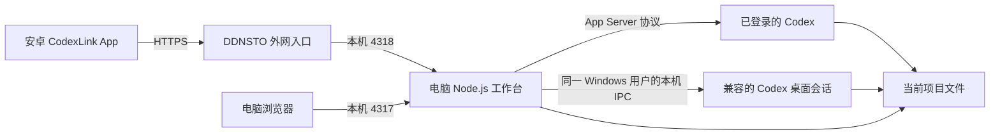

# CodexLink

通过安卓手机，把需求交给电脑上的 Codex 执行。

CodexLink 包含 **安卓 App、电脑后台、网页工作台**。手机用于管理项目、提出需求、上传文档和下载成果；文件和任务在自己的电脑上处理。它是独立项目，使用本机 Codex App Server，并非 OpenAI 官方手机客户端。

当前安卓版本为 **0.12.0**，支持 Android 8.0 及以上。电脑端主要在 Windows 上开发和验证；其他系统尚未完成适配验收。本次源码同步同时包含近期的桌面兼容、后台独立启动和已归档任务提示修复。

## 可以做什么

- **远程处理任务**：提出需求、查看回复和进度、继续对话、回答追问、停止自己的任务。
- **管理项目和文件**：项目卡片首页；新项目按北京时间的日期和时间分目录；从项目下载成果。
- **图片与文档附件**：上传 JPG / PNG / 静态 WebP 图片及 `.docx` / `.pptx` 文档，每个最多 100 MB（100 MiB），每条需求最多三个，可混合选择。上传时可返回上一层，完成后保留在原任务，仍需点击发送。
- **手机与电脑共用会话**：支持与兼容版本的 Windows Codex 桌面使用同一手机任务。电脑占用时交给原会话执行，手机同步进度；需要权限确认或回答时到电脑处理。同一任务每次只执行一轮，连接异常时不会自动重发。
- **对话持续同步**：会话缓存、断线后刷新与分开的读写请求，减少等待时的界面阻塞；隐藏后台独立启动，避免随启动它的桌面进程一起退出。
- **常用技能**：Word 文档、PPT 演示、Excel 表格、PDF 处理、软件开发。调用电脑上已安装并启用的对应技能，也可不指定。
- **账号与共享**：项目默认私有；主动共享后，等级符合要求的账号可以只读查看。管理员可创建账号、调整等级、查看已保存的密码及重新设置密码；旧账号需先重新设置一次才能查看。
- **App 内更新**：检查、下载并校验新版本，由安卓系统确认安装。无需每次手动找安装包。

适合个人远程办公、文档整理、小型软件开发，以及可信成员共用一台电脑的场景。**账号权限控制工作台中的可见性和操作，不提供不同用户之间的操作系统隔离。** 各账号共用电脑上的 Codex 执行环境，部署前请阅读 [权限与数据边界](SECURITY.md)。

## 各软件怎么配合



| 组件 | 负责什么 | 什么时候需要 |
| --- | --- | --- |
| Node.js 22+ | 运行账号、项目、文件和任务后台 | 电脑运行时必需 |
| Codex CLI / 本机 Codex 执行程序 | 理解需求并执行任务 | 必需，先在电脑登录 |
| Windows Codex 桌面 | 手机与电脑共用桌面正在打开的会话 | 按需；使用本机内部协议，版本有兼容限制 |
| DDNSTO | 手机在外网访问电脑服务 | 使用本文外网方案时需要 |
| JDK 17、Android SDK | 编译和签名 APK | 自行构建 App 时需要 |
| 安卓模拟器 | 在电脑预览、测试 App | 可选，真实手机使用不需要 |
| Word、PowerPoint、Excel 或其他兼容阅读器 | 查看生成的 Office 文件 | 按需使用，不是后台启动条件 |
| Git / GitHub | 管理和共享源码 | 开发协作需要，日常运行不需要 |

具体下载入口、安装顺序和参数见 [安装与配套软件](docs/SETUP.md)。本仓库不捆绑这些第三方软件、Codex 登录凭据或技能插件。

## 快速开始

在电脑安装 Node.js、配置并登录可用的 Codex 后，在仓库根目录打开 PowerShell：

```powershell
git clone https://github.com/white-st/codexlink.git
cd codexlink
node --version
codex --version
npm start
```

如果找不到执行程序，可在启动前设置 `CODEX_BIN` 为自己电脑上 `codex.exe` 的完整路径。当前项目没有 npm 第三方依赖，无需先执行 `npm install`。

1. 电脑打开 `http://127.0.0.1:4317`。
2. 根据本机 `.runtime/setup-code.txt` 中的设置码，创建首个管理员账号。
3. 先通过网页完成一次创建项目、发送需求、下载成果的验证。
4. 按 [安装指南](docs/SETUP.md) 配置自己的 DDNSTO 地址，再按 [安卓构建指南](docs/ANDROID.md) 编译连接该地址的 APK。
5. 手机安装后使用同一工作台账号登录。其他用户由管理员创建账号。

**源码没有预置可用账号，也没有连接到作者电脑的安装包。** Android 源码中的示例域名不可访问；构建时必须传入自己的 HTTPS 地址。上传源码到 GitHub 不会自动启动电脑后台，也不会替代 DDNSTO。

## 文档导航

| 文档 | 内容 |
| --- | --- |
| [安装与配套软件](docs/SETUP.md) | 电脑环境、首次设置、启动停止、网络、项目目录 |
| [使用说明](docs/USAGE.md) | 项目、任务、附件、技能、共享和更新 |
| [安卓构建](docs/ANDROID.md) | JDK / SDK 参数、服务地址、签名、APK 分发、模拟器 |
| [源码结构](docs/ARCHITECTURE.md) | 模块职责、调用关系、文件与配置说明 |
| [开发与验证](docs/DEVELOPMENT.md) | 检查命令、测试边界、实验性工具 |
| [常见问题](docs/TROUBLESHOOTING.md) | 连接失败、登录过期、文档上传、任务占用 |
| [权限与数据边界](SECURITY.md) | 私有数据、执行边界、共享、备份和上传排除项 |
| [版本记录](CHANGELOG.md) | 当前版本及已完成能力 |

## 当前边界

- 手机端目前只提供 Android App，未提供 iOS App。
- App 首页为“项目”和“我的”；网页仍保留手机任务和已登记电脑任务列表。
- 共享项目当前只读，不能让其他账号在项目中发指令。
- 手机上传支持 JPG / PNG / 静态 WebP 及 `.docx` / `.pptx`，不支持 GIF、HEIC、动态 WebP、旧版 `.doc` / `.ppt`、加密 Office 文档或直接上传 PDF / Excel。PDF / Excel 技能可创建成果或处理项目中已有文件。
- App 需要电脑后台、网络和可用 Codex 登录状态；不是在手机上离线运行模型。
- App 不能强制释放官方桌面 Codex 占用的任务，也不能在安卓上静默完成升级安装。
- 桌面共用会话依赖同一 Windows 用户和会话下的官方签名进程及其内部 IPC 协议，桌面升级可能影响兼容。协议不匹配时会报错，不会强制抢占任务或另建对话代发；需要电脑确认的操作仍在电脑处理。
- 五类技能不是随仓库附送的插件，其他电脑是否可用取决于它的 Codex 安装与技能目录。
- 管理员可以取得用户密码并使用该账号登录；私有项目规则不代表内容对掌握密码的管理员保密。请仅给可信人员管理员权限。

## 项目许可

项目所有者尚未选择开源许可证，本次准备未擅自添加 LICENSE。第三方软件与插件继续遵守各自的许可和使用条件。
